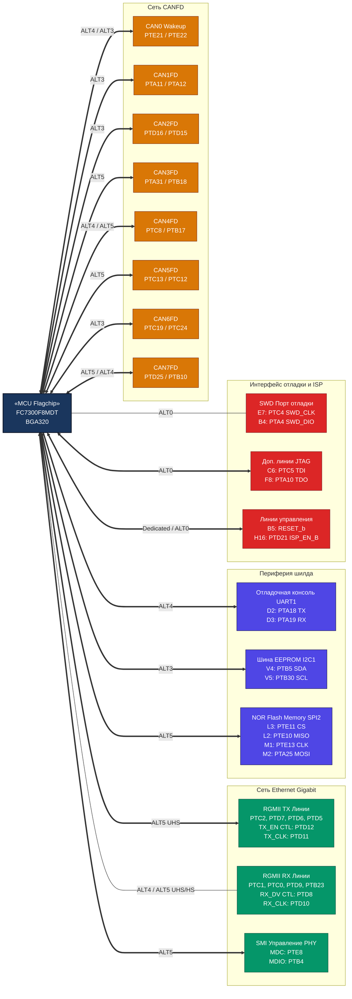
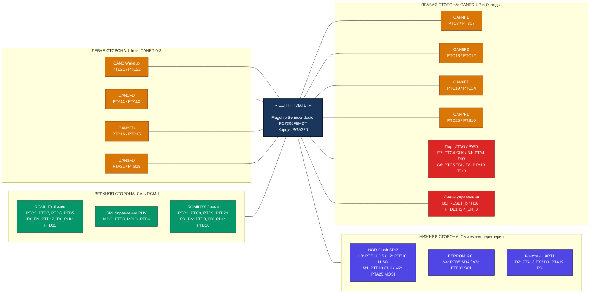

# Диаграмма подключения интерфейсов к контроллеру FC7300F8MDT

Распределение всех разработанных интерфейсов шилда и портов отладки по конкретным физическим выводам микроконтроллера FC7300F8MDT в корпусе BGA320.

# Mermaid-диаграмма с радиальным расположением интерфейсов вокруг контроллера

Для того чтобы обойти стандартную особенность вертикального рендеринга Mermaid (сверху вниз) и расположить устройства строго **вокруг** контроллера, используется радиальная структура связей. Ниже представлена переработанная диаграмма, где за счет жесткого распределения невидимых связей блоки разнесены по сторонам света относительно центрального процессора.

> ⚠️ **Предупреждение:** Парсер Mermaid в некоторых старых встроенных визуализаторах всё равно может перестраивать блоки горизонтально (слева направо). Для идеальной круговой топологии печатной платы рекомендуется использовать этот граф как логическое зонирование: Ethernet — строго вверх, CAN0-3 — влево, CAN4-7 и отладка — вправо, медленная шинная периферия памяти и консоли — вниз.

<FollowUp>
Помогло ли изменение типа графа (`graph LR` вместо `graph TD` со связыванием подграфов) распределить устройства по сторонам от контроллера в вашем визуализаторе? Если структура утверждена, требуется ли подготовить **C-код инициализации для регистров маппинга остальных периферийных модулей (SPI2, I2C1, UART1)**?
</FollowUp>
