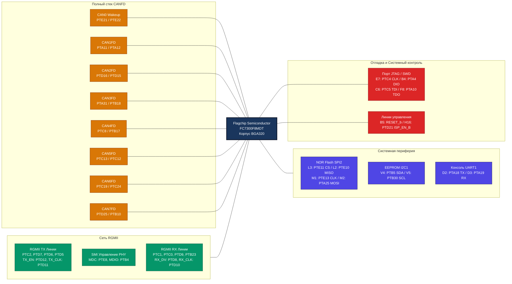

# Диаграмма подключения интерфейсов к контроллеру FC7300F8MDT

```mermaid
graph LR
    %% Стилизация компонентов
    classDef mcu fill:#1a365d,stroke:#0f172a,stroke-width:3px,color:#ffffff;
    classDef can fill:#d97706,stroke:#7c2d12,stroke-width:1px,color:#ffffff;
    classDef eth fill:#059669,stroke:#064e3b,stroke-width:1px,color:#ffffff;
    classDef debug fill:#dc2626,stroke:#7f1d1d,stroke-width:1px,color:#ffffff;
    classDef peri fill:#4f46e5,stroke:#1e1b4b,stroke-width:1px,color:#ffffff;

    %% -------------------------------------------------------------
    %% ИНТЕРФЕЙСЫ CANFD
    %% -------------------------------------------------------------
    subgraph CANFD_Stack [Полный стек CANFD]
        CAN_W[CAN0 Wakeup<br>PTE21 / PTE22]:::can
        CAN1[CAN1FD<br>PTA11 / PTA12]:::can
        CAN2[CAN2FD<br>PTD16 / PTD15]:::can
        CAN3[CAN3FD<br>PTA31 / PTB18]:::can
        CAN4[CAN4FD<br>PTC8 / PTB17]:::can
        CAN5[CAN5FD<br>PTC13 / PTC12]:::can
        CAN6[CAN6FD<br>PTC19 / PTC24]:::can
        CAN7[CAN7FD<br>PTD25 / PTB10]:::can
    end

    %% -------------------------------------------------------------
    %% СЕТЕВОЙ ИНТЕРФЕЙС ETHERNET
    %% -------------------------------------------------------------
    subgraph ETH_Stack [Сеть RGMII]
        RGMII_TX[RGMII TX Линии<br>PTC2, PTD7, PTD6, PTD5<br>TX_EN: PTD12, TX_CLK: PTD11]:::eth
        SMI_MGMT[SMI Управление PHY<br>MDC: PTE8, MDIO: PTB4]:::eth
        RGMII_RX[RGMII RX Линии<br>PTC1, PTC0, PTD9, PTB23<br>RX_DV: PTD8, RX_CLK: PTD10]:::eth
    end

    %% -------------------------------------------------------------
    %% ЦЕНТРАЛЬНЫЙ ПРОЦЕССОР
    %% -------------------------------------------------------------
    MCU[Flagchip Semiconductor<br>FC7300F8MDT<br>Корпус BGA320]:::mcu

    %% -------------------------------------------------------------
    %% СИСТЕМНАЯ ПЕРИФЕРИЯ ПЛАТЫ
    %% -------------------------------------------------------------
    subgraph PERI_Stack [Системная периферия]
        SPI_FLASH[NOR Flash SPI2<br>L3: PTE11 CS / L2: PTE10 MISO<br>M1: PTE13 CLK / M2: PTA25 MOSI]:::peri
        I2C_EEPROM[EEPROM I2C1<br>V4: PTB5 SDA / V5: PTB30 SCL]:::peri
        UART_CONS[Консоль UART1<br>D2: PTA18 TX / D3: PTA19 RX]:::peri
    end

    %% -------------------------------------------------------------
    %% ОТЛАДКА, ПРОГРАММИРОВАНИЕ И УПРАВЛЕНИЕ
    %% -------------------------------------------------------------
    subgraph DEBUG_Stack [Отладка и Системный контроль]
        DEBUG_PORT[Порт JTAG / SWD<br>E7: PTC4 CLK / B4: PTA4 DIO<br>C6: PTC5 TDI / F8: PTA10 TDO]:::debug
        SYS_CTRL[Линии управления<br>B5: RESET_b / H16: PTD21 ISP_EN_B]:::debug
    end

    %% -------------------------------------------------------------
    %% БЕЗНАПРАВЛЕННЫЕ СВЯЗИ ДЛЯ КОРРЕКТНОЙ ГЕОМЕТРИИ ОКРУЖЕНИЯ
    %% -------------------------------------------------------------
    ETH_Stack --- MCU
    MCU --- PERI_Stack

    CAN_W --- MCU
    CAN1 --- MCU
    CAN2 --- MCU
    CAN3 --- MCU
    CAN4 --- MCU
    CAN5 --- MCU
    CAN6 --- MCU
    CAN7 --- MCU

    MCU --- DEBUG_PORT
    MCU --- SYS_CTRL
```

</FollowUp>
