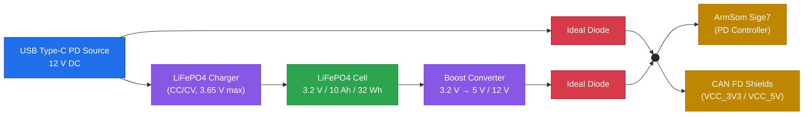

# Power Supply

The system is powered from a single **12 V DC source** delivered through the onboard **USB Type-C PD controller** of the ArmSom Sige7. A **backup battery** is provided to keep the CAN FD controllers and the host alive during main power loss.

### Primary Power Input

| Parameter | Value | Notes |
| :--- | :--- | :--- |
| Input voltage | **12 V DC** | Via Type-C PD (Power Delivery) negotiation |
| Connector | USB Type-C | Must support PD profile ≥ 12 V |
| PD controller | Onboard Sige7 | Handles voltage/current negotiation |
| Max input current | TBD | Depends on PD source and Sige7 limits |

> **Note:** Ensure the Type-C PD source can supply enough current for the Sige7 plus all four CAN FD shields. A 12 V / 3 A (36 W) PD source is recommended as a minimum.

### Backup Battery

A **LiFePO4** cell is used as the backup energy storage. LiFePO4 chemistry was chosen for its high cycle life (>3000 cycles), stable discharge voltage, and inherent safety compared to standard Li-ion.

| Parameter | Value |
| :--- | :--- |
| Chemistry | **LiFePO4** (Lithium Iron Phosphate) |
| Model | `LFP12x66x131-10A` |
| Nominal voltage | **3.2 V** |
| Capacity | **10 Ah (10000 mAh)** |
| Energy | **32 Wh** (exceeds the 20 Wh minimum) |
| Discharge current | 5 A continuous / 10 A peak |
| Cell form factor | Pouch |
| Dimensions | 12 × 66 × 131 mm |
| Weight | 0.19 kg |
| Cycle life | > 3000 cycles |
| Product link | [neter.pro — Art. 120636](https://neter.pro/product-120636) |

> **Why this cell?**  
> The single 3.2 V / 10 Ah LiFePO4 cell provides **32 Wh** of usable energy — comfortably above the 20 Wh requirement — while maintaining a very flat discharge curve (~3.2 V nominal). This makes it suitable for powering a boost converter that generates a stable rail for the Sige7 and the CAN FD shields during brownouts or main power loss.

### Backup Power Path (Conceptual)

### Design Considerations

1. **Charging the LiFePO4 cell**
   - Requires a dedicated **LiFePO4 charger** (CC/CV, max 3.65 V per cell). Do **not** use a standard Li-ion 4.2 V charger.
   - Recommended charge current: **0.5C – 1C** (5 A – 10 A) for fast charging, or lower for extended cell life.
   - A proper **BMS** (Battery Management System) is mandatory for overcharge, over-discharge, overcurrent, and short-circuit protection.

2. **Boost converter**
   - The 3.2 V nominal output of the cell must be stepped up to the rails required by the Sige7 and the shields (typically **5 V** for the shields and **5 V / 12 V** for the SBC, depending on the PD path used).
   - Choose a boost converter rated for at least **1.5× the expected continuous load** to avoid thermal issues.
   - Consider a **buck-boost** topology if the SBC is sensitive to voltage sags below 3.2 V.

3. **Power path / failover**
   - Use an **ideal diode** or **PowerPath** controller to automatically switch between the PD source and the backup battery when the main supply is lost.
   - Avoid back-feeding the PD source when running from battery.

4. **Thermal management**
   - LiFePO4 is thermally stable, but the boost converter and charger should still have adequate copper area or heatsinking.
   - Keep the cell away from heat sources (regulators, SBC) to maximize cycle life.

5. **Fusing and protection**
   - Add a **resettable fuse (PTC)** or a standard fuse on the battery output.
   - Add reverse-polarity protection on the input side.

### Summary

| Rail | Source | Notes |
| :--- | :--- | :--- |
| **12 V (main)** | USB Type-C PD | Primary power for the Sige7 |
| **3.2 V (battery)** | LiFePO4 cell (10 Ah / 32 Wh) | Backup energy storage |
| **5 V (system)** | Buck-boost from battery or PD | Feeds the shields and SBC logic |
| **3.3 V (logic)** | Onboard SBC regulator | Feeds CAN FD shield logic |

The combination of a **12 V PD input** and a **32 Wh LiFePO4 backup cell** provides a robust, safe, and long-life power architecture for a 4-shield / 8-channel CAN FD system.
