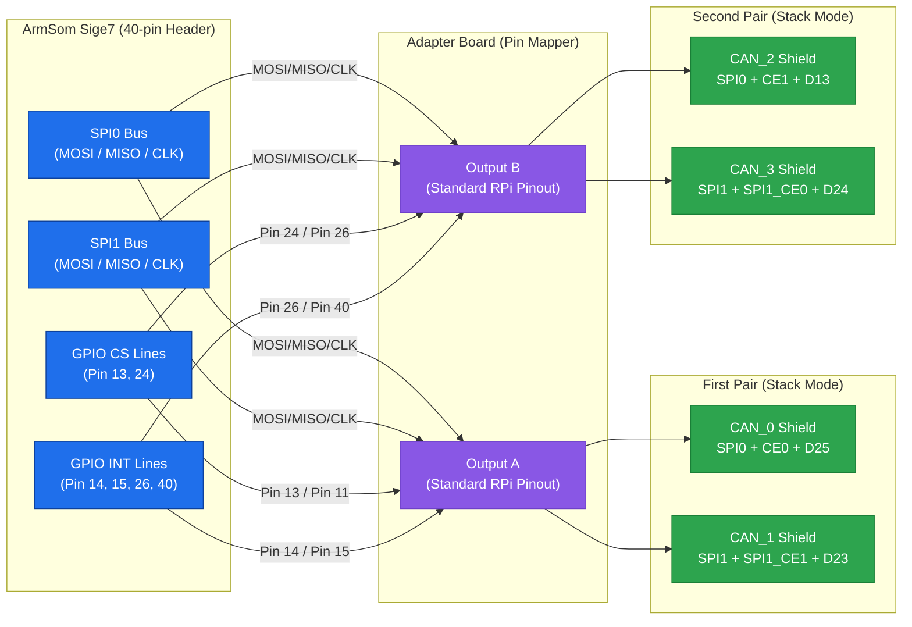

# CAN FD Shields Adapter Board for ArmSom Sige7

## 1. Overview

This document describes the design and configuration of a custom adapter board used to connect **four dual-channel CAN FD shields** (based on MCP251xFD controllers) to a single **ArmSom Sige7** single-board computer via its 40-pin header.

Because the Sige7 (like most Raspberry Pi-compatible SBCs) only exposes a limited number of hardware Chip Select (CS) lines, the adapter board acts as a **pin mapper**, routing signals from the Sige7 to two separate 40-pin headers. Each header emulates a standard Raspberry Pi pinout for a pair of stacked shields.

## 2. Adapter Board Architecture

The adapter board contains three 40-pin connectors:

1. **Input:** 40-pin connector for the ArmSom Sige7.
2. **Output A:** 40-pin connector for the first pair of shields (Stack Mode).
3. **Output B:** 40-pin connector for the second pair of shields (Stack Mode).

### 2.1. Signal Mapping Strategy

The adapter board routes signals cross-wise to ensure that each shield pair sees the expected pinout for its configuration, as defined by the shield's own hardware configuration (0R resistor jumpers).

- **Shared SPI Bus Lines:** MOSI, MISO, and CLK are routed in parallel from the Sige7 to both output connectors.
- **Unique CS and INT Lines:** Each shield pair requires unique Chip Select (CS) and Interrupt (INT) lines. The adapter board routes these to different physical pins on the Sige7, while mapping them to the standard CS/INT pin locations on the output connectors.

## 3. Pin Assignment and Configuration

Based on the provided [schematic (J4)](40-pin-sige7-spi.md) and the shield's "Stack Mode" documentation, the pin assignments are divided into two groups.

### 3.1. First Pair of Shields (Output A)

Connected to **SPI0** and **SPI1** using the primary CS and INT pins.

| Function | Sige7 Pin | Sige7 GPIO | Shield Config | Description |
| :--- | :---: | :---: | :---: | :--- |
| **SPI0_MOSI** | 19 | - | - | Shared SPI0 Data Out |
| **SPI0_MISO** | 21 | - | - | Shared SPI0 Data In |
| **SPI0_CLK** | 23 | - | - | Shared SPI0 Clock |
| **SPI0_CS** | 13 | GPIO4_C6 | `CE0` | Chip Select for CAN_0 |
| **SPI0_INT** | 14 | GPIO1_D7 | `D25` / `D13` | Interrupt for CAN_0 |
| **SPI1_MOSI** | 38 | - | - | Shared SPI1 Data Out |
| **SPI1_MISO** | 35 | - | - | Shared SPI1 Data In |
| **SPI1_CLK** | 12 | - | - | Shared SPI1 Clock |
| **SPI1_CS** | 11 | - | `SPI1_CE1` | Chip Select for CAN_1 |
| **SPI1_INT** | 15 | GPIO1_B7 | `D23` | Interrupt for CAN_1 |

### 3.2. Second Pair of Shields (Output B)

Connected to **SPI0** and **SPI1** using secondary CS and INT pins. The adapter board maps these signals to the standard CS/INT pin locations on Output B.

| Function | Sige7 Pin | Sige7 GPIO | Shield Config | Description |
| :--- | :---: | :---: | :---: | :--- |
| **SPI0_MOSI** | 19 | - | - | Shared SPI0 Data Out |
| **SPI0_MISO** | 21 | - | - | Shared SPI0 Data In |
| **SPI0_CLK** | 23 | - | - | Shared SPI0 Clock |
| **SPI0_CS** | 24 | - | `CE1` | Chip Select for CAN_2 |
| **SPI0_INT** | 26 | - | `D13` | Interrupt for CAN_2 |
| **SPI1_MOSI** | 38 | - | - | Shared SPI1 Data Out |
| **SPI1_MISO** | 35 | - | - | Shared SPI1 Data In |
| **SPI1_CLK** | 12 | - | - | Shared SPI1 Clock |
| **SPI1_CS** | 26 | - | `SPI1_CE0` | Chip Select for CAN_3 |
| **SPI1_INT** | 40 | - | `D24` | Interrupt for CAN_3 |

> **Note:** The specific GPIO pins used for the second pair's CS and INT must be configured as GPIOs in the Device Tree, as they may be multiplexed with other functions (e.g., I2S, SPI0_CE1).

## 4. Device Tree Configuration (DTS)

Since the adapter board uses GPIOs for Chip Select, the Device Tree must be modified to define `cs-gpios` for each SPI bus and specify the correct interrupt pins.

### 4.1. Conceptual DTS Overlay

```dts
/* SPI0 Configuration */
&spi0 {
    status = "okay";
    /* Define GPIOs used as Chip Selects */
    cs-gpios = <&gpio4 22 GPIO_ACTIVE_LOW>, /* Pin 13: First Pair CAN_0 */
               <&gpio1 10 GPIO_ACTIVE_LOW>; /* Pin 24: Second Pair CAN_2 */

    /* First Pair - CAN_0 */
    can0: can@0 {
        compatible = "microchip,mcp251xfd";
        reg = <0>; /* Uses first CS (Pin 13) */
        spi-max-frequency = <20000000>;
        interrupt-parent = <&gpio1>;
        interrupts = <23 IRQ_TYPE_LEVEL_LOW>; /* Pin 14 */
    };

    /* Second Pair - CAN_2 */
    can2: can@1 {
        compatible = "microchip,mcp251xfd";
        reg = <1>; /* Uses second CS (Pin 24) */
        spi-max-frequency = <20000000>;
        interrupt-parent = <&gpio0>;
        interrupts = <26 IRQ_TYPE_LEVEL_LOW>; /* Pin 26 */
    };
};

/* SPI1 Configuration */
&spi1 {
    status = "okay";
    /* Define GPIOs used as Chip Selects */
    cs-gpios = <&gpio1 11 GPIO_ACTIVE_LOW>, /* Pin 11: First Pair CAN_1 */
               <&gpio1 12 GPIO_ACTIVE_LOW>; /* Pin 26: Second Pair CAN_3 */

    /* First Pair - CAN_1 */
    can1: can@0 {
        compatible = "microchip,mcp251xfd";
        reg = <0>;
        spi-max-frequency = <20000000>;
        interrupt-parent = <&gpio1>;
        interrupts = <15 IRQ_TYPE_LEVEL_LOW>; /* Pin 15 */
    };

    /* Second Pair - CAN_3 */
    can3: can@1 {
        compatible = "microchip,mcp251xfd";
        reg = <1>;
        spi-max-frequency = <20000000>;
        interrupt-parent = <&gpio3>;
        interrupts = <24 IRQ_TYPE_LEVEL_LOW>; /* Pin 40 */
    };
};
```

### 4.2. Shield Hardware Configuration

Ensure the 0R resistors on the shields are set according to the "Stack Mode" documentation:

- **CAN_0 (First Pair):** Set to `CE0` and `D25` (or `D13`).
- **CAN_1 (First Pair):** Set to `SPI1_CE1` and `D23`.
- **CAN_2 (Second Pair):** Set to `CE1` and `D13`.
- **CAN_3 (Second Pair):** Set to `SPI1_CE0` and `D24`.

## 5. Summary

By using a custom adapter board to map signals, it is possible to connect four dual-channel CAN FD shields to a single Sige7, providing **8 independent CAN FD interfaces**.

**Key Design Requirements:**

1. **Unique CS Lines:** Each shield must have a dedicated CS line, either hardware or software (GPIO).
2. **Unique INT Lines:** Each shield must have a dedicated interrupt line.
3. **Shared SPI Bus:** MOSI, MISO, and CLK are shared per SPI bus.
4. **Correct DTS:** The Device Tree must define `cs-gpios` and `interrupts` for each of the 8 controllers.

## 6. Connection Diagram



## Appendix: Shield Hardware Modification Reference

This section is a reference for modifying the 0R resistor jumpers on the CAN FD shields, as described in the manufacturer's official "Stack Mode" documentation. These modifications determine which physical pins on the 40-pin header are used for the **Chip Select (CE)** and **Interrupt (INT)** signals of each CAN controller.

### Principle

> **Principle:** Modify the 0R resistor in the `CAN_x PIN SELECTION` (where `x` is `0` or `1`) area on the back of the shield to change the CE and INT pins used by the CAN controller.
>
> **Note:** When stacking is required, the hardware configuration must be kept in **dual SPI mode** (`'A'` mode, which is the default setting).

Each shield contains two independent CAN controllers (`CAN_0` and `CAN_1`), and each has its own set of selectable CE/INT pin combinations.

### CAN_0 Pin Selection

`CAN_0` has **two groups** to choose from:

| CE_0 | INT_0 | Config Setting | Description |
| :---: | :---: | :--- | :--- |
| `CE0` | `D25` | `dtoverlay=mcp251xfd,spi0-0,interrupt=25` | CAN_0 uses `SPI0-0`, interrupt pin is `25` |
| `CE1` | `D13` | `dtoverlay=mcp251xfd,spi0-1,interrupt=13` | CAN_0 uses `SPI0-1`, interrupt pin is `13` |

### CAN_1 Pin Selection

`CAN_1` has **three groups** to choose from:

| CE_1 | INT_1 | Config Setting | Description |
| :---: | :---: | :--- | :--- |
| `SPI1_CE0` | `D24` | `dtoverlay=mcp251xfd,spi1-0,interrupt=24` | CAN_1 uses `SPI1-0`, interrupt pin is `24` |
| `SPI1_CE1` | `D23` | `dtoverlay=mcp251xfd,spi1-1,interrupt=23` | CAN_1 uses `SPI1-1`, interrupt pin is `23` |
| `SPI1_CE2` | `D22` | `dtoverlay=mcp251xfd,spi1-2,interrupt=22` | CAN_1 uses `SPI1-2`, interrupt pin is `22` |

> **Note:** A careful reader may notice that one configuration group is missing from the table above. This is **reserved for compatibility with older hardware versions**, and new users can safely ignore it.

### Example: Configuring Two Shields for 4-Channel CAN

**Question:** If you have two shields, how should they be configured to use 4-way CAN?

**Answer:**

- **First shield:** Leave unmodified (default configuration, as shown in the *left figure* of the manufacturer's documentation).
- **Second shield:** Modify the 0R jumpers on the back as follows:
  - **`CAN_0` configuration area:** Select `CE1` and `D13`.
  - **`CAN_1` configuration area:** Select `SPI1_CE1` and `D23`.


### Jumper Settings for This Adapter Board

For the adapter board described in this document (connecting **four** shields), the required jumper settings are:

| Shield | CAN Controller | CE Setting | INT Setting | SPI Bus | Notes |
| :--- | :--- | :---: | :---: | :---: | :--- |
| **Shield 1** (Pair A) | CAN_0 | `CE0` | `D25` | SPI0-0 | Default |
| **Shield 1** (Pair A) | CAN_1 | `SPI1_CE1` | `D23` | SPI1-1 | Modified |
| **Shield 2** (Pair A) | CAN_0 | `CE1` | `D13` | SPI0-1 | Modified |
| **Shield 2** (Pair A) | CAN_1 | `SPI1_CE2` | `D22` | SPI1-2 | Modified |
| **Shield 3** (Pair B) | CAN_0 | `CE0` | `D25` | SPI0-0 | Default |
| **Shield 3** (Pair B) | CAN_1 | `SPI1_CE1` | `D23` | SPI1-1 | Modified |
| **Shield 4** (Pair B) | CAN_0 | `CE1` | `D13` | SPI0-1 | Modified |
| **Shield 4** (Pair B) | CAN_1 | `SPI1_CE2` | `D22` | SPI1-2 | Modified |

> **Important:** Since the adapter board uses **software CS (GPIO)** for the second pair of shields, the `config settings` shown in the tables above (which use standard `dtoverlay` syntax) are provided **for reference only**. The actual Device Tree configuration for this project must be customized, using `cs-gpios` and explicit `interrupts` properties.

