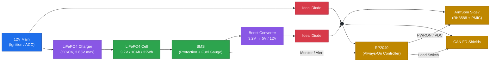
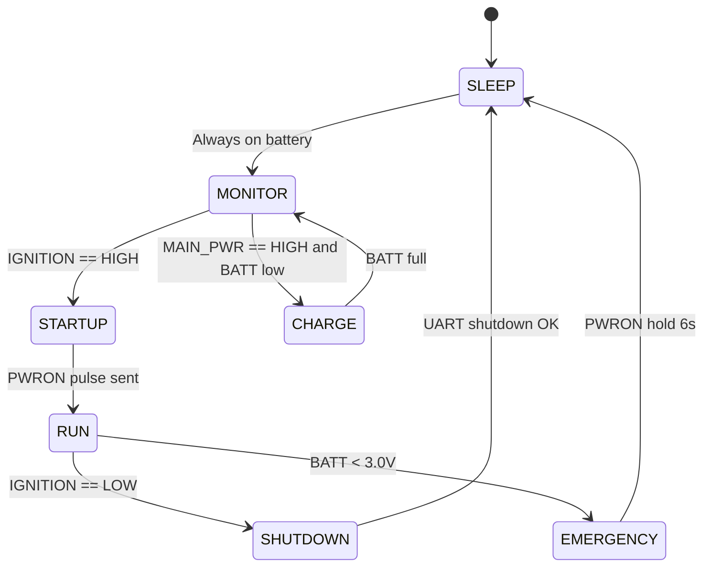

# System Controller (RP2040)

## 1. Overview

The **RP2040** acts as the system controller for the entire device. Unlike the ArmSom Sige7 (RK3588), which is the main compute unit, the RP2040 is **always-on** and is powered directly from the backup battery rail. Its responsibilities are:

- Monitor the **ignition key** signal and the **main power** presence.
- Manage the **LiFePO4 battery** (charging, monitoring, protection coordination).
- Control **power sequencing** of the Sige7 and the CAN FD shields.
- Implement **energy-saving** policies (peripheral shutdown, sleep modes).
- Handle **emergency shutdown** on low battery, over-temperature, or fault conditions.

The RK3588 has its own PMIC (RK806) with wake-up banks, but its logic is fixed and oriented toward the SoC itself. An external RP2040 gives full control over custom power scenarios — especially "ignition key → start system" and "main power loss → switch to battery".

## 2. Architecture

The RP2040 is powered from the same combined power rail as the Sige7 and the CAN FD shields. It receives status information from the BMS via a dedicated signal line, and it controls the Sige7 (PWRON/VDC) and the shields (Load Switch).



## 3. Responsibilities

| Function | Description |
| :--- | :--- |
| **Ignition monitoring** | Reads the `IGNITION` input (12 V via divider). |
| **Main power monitoring** | Reads the `MAIN_PWR` input (12 V via divider). |
| **Battery charging control** | Enables/disables the LiFePO4 charger, monitors voltage and current. |
| **Battery monitoring** | Reads battery voltage via ADC, receives status from BMS. |
| **Sige7 power control** | Emulates PWRON button and/or drives VDC. |
| **Peripheral power control** | Controls load switches for CAN FD shields and USB hubs. |
| **Energy saving** | Shuts down unused peripherals, enters low-power sleep. |
| **Emergency handling** | Forces shutdown on low battery or fault. |

## 4. Power Inputs and Outputs

| Signal | Direction | Description |
| :--- | :--- | :--- |
| `V_SYS` | Input | Combined power rail (from ideal diode OR-ing). |
| `IGNITION` | Input | Ignition key signal (12 V → divider → 3.3 V). |
| `MAIN_PWR` | Input | Main power presence (12 V → divider → 3.3 V). |
| `BATT_V` | Input | Battery voltage via ADC divider. |
| `BMS_ALERT` | Input | Fault/alert line from BMS. |
| `PWRON` | Output | Emulated power button to Sige7 PMIC. |
| `VDC` | Output | Optional: VDC control to Sige7 PMIC. |
| `SHIELD_EN` | Output | Load switch enable for CAN FD shields. |
| `CHG_EN` | Output | Enable signal for LiFePO4 charger. |
| `UART_TX/RX` | Bidirectional | Communication with Sige7 for graceful shutdown. |

## 5. State Machine



| State | Action |
| :--- | :--- |
| `SLEEP` | RP2040 in low-power mode, waits for IGNITION or MAIN_PWR interrupt. |
| `MONITOR` | Periodically polls battery, ignition, main power. |
| `CHARGE` | Enables charger, monitors current and voltage. |
| `STARTUP` | Sends PWRON pulse, waits for Sige7 response. |
| `RUN` | Normal operation, sends heartbeat, monitors events. |
| `SHUTDOWN` | Sends `shutdown` command over UART, waits for PMIC off. |
| `EMERGENCY` | Forced shutdown on low battery or over-temperature. |

## 6. Sige7 Power Control

The RK3588 PMIC (RK806) supports two main control methods:

### Method A — PWRON button emulation
- RP2040 pulls `PWRON` low for ~20 ms to start the system.
- Holding `PWRON` low for ≥6 s forces shutdown.
- **Pros:** simple, independent of SoC state.
- **Cons:** hard shutdown, no data saving.

### Method B — VDC control
- RP2040 drives `VDC` high → PMIC auto-starts.
- To shut down, RP2040 must first pull `VDC` low, then send `shutdown` via UART.
- **Pros:** closer to automotive "ignition" semantics.
- **Cons:** requires locating VDC pin and level shifting.

### Recommended — Hybrid (Method C)
- **Start:** PWRON pulse (reliable).
- **Stop:** UART `shutdown` command → Linux powers off cleanly → PMIC cuts power.
- **Emergency stop:** PWRON hold 6 s if system does not respond.

## 7. Ignition Key Monitoring

The `IGNITION` input is a 12 V signal from the vehicle. A voltage divider and protection network convert it to 3.3 V logic:

```
IGN (12V) ──┤ R1 ├──┬── RP2040 GPIO (3.3V)
                    │
                   R2
                    │
                   GND
```

- R1 = 100 kΩ, R2 = 33 kΩ → ≈3.0 V at 12 V input.
- Additional protection: 3.3 V Zener diode and RC filter (10 kΩ + 100 nF) for automotive transients.
- RP2040 reads the input as "ignition ON" when level > 2.0 V.

The same circuit is used for `MAIN_PWR`.

## 8. Battery Monitoring

The RP2040 has a 12-bit ADC (0–3.3 V). For a LiFePO4 cell (3.0–3.65 V), a divider is used:

```
BATT+ ──┤ R1 ├──┬── RP2040 ADC
                │
               R2
                │
               GND
```

- R1 = 10 kΩ, R2 = 20 kΩ → 3.65 V → 2.43 V (within ADC range).
- ADC reference: internal 3.3 V.

Additionally, a **fuel gauge** (e.g., MAX17048) can be connected via I2C for accurate State of Charge (SOC).

## 9. Energy Saving

The RP2040 controls peripheral power through **load switches** (e.g., TPS22918):

- **CAN FD shields** — disabled when system is in `SLEEP`.
- **USB hubs** — disabled when no activity.
- **Indicators** — only on event.

In `SLEEP` mode the RP2040 consumes **<1 mA**, which is critical for a 32 Wh battery — theoretically months of shelf life.

## 10. Protection and Reliability

1. **Watchdog** — must be enabled. If RP2040 hangs, it resets and continues.
2. **Brown-out detection** — RP2040 must reset correctly on supply dips.
3. **Fallback path** — if RP2040 fails, Sige7 can still be started manually via button.
4. **Isolation** — IGNITION and MAIN_PWR lines must be protected with TVS diodes against automotive transients (load dump, ISO 7637-2).

## 11. Summary

The RP2040 system controller provides:

- **Always-on monitoring** of ignition and main power.
- **Battery management** coordination with BMS.
- **Power sequencing** for the Sige7 and CAN FD shields.
- **Energy-saving** policies for extended battery life.
- **Emergency handling** for safe shutdown.

By delegating these tasks to a dedicated low-power MCU, the RK3588 can focus on its compute workload, while the overall system remains robust, efficient, and safe.
